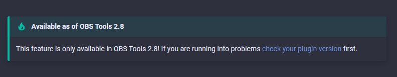
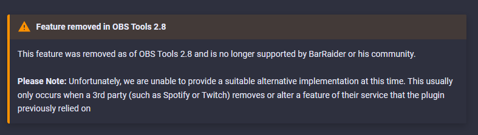
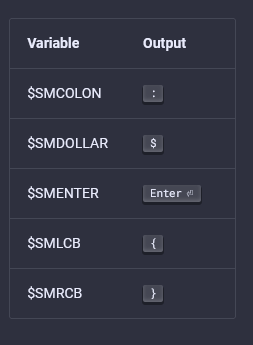

# Customized Functions

The mkdocs-macros plugin is an incredibly powerful part of our site.  It allowed Cyberlight to build several pieces of custom functionality,  but has a few minor trade-offs we deal with as a result.  Both are outlined below.

## Convenience methods

These methods currently quickly generate version information in the form of an admonition panel.  There are currently 3 variants.

`{{ newIn("OBS Tools 2.8")}}`



`{{ removedIn("OBS Tools 2.8") }}`


as well as an alternate shortcut for situations where a replacement is not an option.

`{{ removedIn("OBS Tools 2.8", false) }}`



`{{ centeredImage("./img/title.png", "Some plugins require the title field to be empty.") }}`

Centers an image (with an optional caption) using code originally provided by @Geekie2014


## Custom Metadata

Metadata may be optionally added to each page of the documentation to improve readability in search engines and social media.  In the absence of custom metadata. For example:

```yaml
---
title: Spotify Actions
description: A breakdown of all possible actions in the Spotify StreamDeck Plugin
repo: https://github.com/barraider/imaginary-spotify-repo
discussion: https://discord.com/link/to/the/forum/thread/for/this/page
robots: false
---
```

`title`

When present, this title is appended to the main site title for this page.  The full title in the example above would be: "BarRaider Docs: Spotify Actions"  

`description`

If present, overrides the general site description for this page of the KB.

`repo`

If present, links to the Github repository for the plugin referenced on this page. Displayed in the header when present.


`discussion`

If present, adds a link to the footer of the page which should lead to a Discord Forum thread dedicated to discussion of this page.


`robots: false`

Instructs web crawlers not to index or follow links on this page.  Both actions are permitted by default.

*Note: To disable search crawling site-wide, you can also set `do_not_index: true` in `base.yml`.*

## Displaying Keyboard and Mouse Input

Because MkDocs offers more than plain Markdown, we can use more intuitive displays for keyboard and mouse input, simply by wrapping the desired input name in double plus signs.  Consider this updated table from SuperMacro > Variables.

```markdown

| Variable   | Output          |
|------------|-----------------|
| $SMCOLON   | ++colon++       |
| $SMDOLLAR  | ++"$"++         |
| $SMENTER   | ++enter++       |
| $SMLCB     | ++brace-left++  |
| $SMRCB     | ++brace-right++ |
```



Refer to the [Usage Guide](
https://facelessuser.github.io/pymdown-extensions/extensions/keys/) for all the available keys, and note that adding a custom key (like our `$`) is as easy as wrapping the key in quotes.

## Conflicts between MkDocs and SuperMacro

The template engine that our documentation site runs on ([MkDocs](https://www.mkdocs.org/)) happens to use `{{}}` for it's own macro-code statements.  After enabling customizations, SuperMacro commands no longer rendered correctly.  There were two ways around this:

### Wrapping SuperMacro Commands As Strings
With a relatively quick Find & Replace command, Cyberlight was able to correct this problem by wrapping the SuperMacro blocks as strings.

|Original|Updated|
--- | ---|
|{{SPACE}}|{{ "{{SPACE}}" }}|
|{{CTRL}{C}}|{{ "{{CTRL}{C}}" }}|

As such, the find and replace commands were performed in 2 steps, as follows

|Find|Replace|
---|---|
|{{ | {{ "{{|
|}} | }}" }}

**Note:** If this becomes problematic in the future, a simple script could be written to automate this process.

### Alternative: Disabling macros on specific pages
```yaml
---
ignore_macros: true
---
```
A simple line at the top of each affected page can disable macros for that page, but the page will lose some of the functionality described above.  Having already built the custom functions above, Cyberlight chose the first option for now.