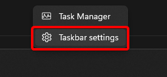

# Battery - iCue
!!! warning "English required"

    Before starting, make sure iCue is set to English language, plugin does not work with any other language.

## Installation
Please follow these step-by-step instructions to allow the Stream Deck plugin to read the battery stats from your CORSAIR device.

### iCue 4 and above

1. Open iCue and select your device from the top menu bar.
2. On the left hand side, click **Device Settings**.
3. Toggle on** Enable Battery Gauge in Notification Area**.

4. Right-click the Windows taskbar and choose (2) **Taskbar Settings**.
    5. **Windows 10:** Scroll down to the Notification Area and click on (1) **Select which icons appear on the taskbar**.
    6. **Windows 11:** Click on **Other system tray icons**.
5. Find iCue in the list and toggle it on.

6. Verify that you now have a battery icon on the taskbar and notice the name of the device is showing along with the battery status.
 

7. In the plugin, write the name of the device as shown in the image above (in this case type IRONCLAW).

1. 
2. 

### iCue 3 - Legacy devices

1. Open iCue and select your device from the top menu bar.
2. On the left hand side, click **Device Settings**.
3. Toggle on** Enable Battery Gauge in Notification Area**.

4. Right-click the Windows taskbar and choose (2) **Taskbar Settings**.
    5. **Windows 10:** Scroll down to the Notification Area and click on (1) **Select which icons appear on the taskbar**.
    6. **Windows 11:** Click on **Other system tray icons**.
5. Find iCue in the list and toggle it on.

6. Verify that you now have a battery icon on the taskbar and notice the name of the device is showing along with the battery status.
 

7. In the plugin, write the name of the device as shown in the image above (in this case type IRONCLAW).

1. 
2. 

##  Troubleshooting
### The Enable Battery in System Tray option doesn't exist for my device
This seems to be an issue with iCue for some devices. Reach out to [CORSAIR](https://www.corsair.com/us/en/contact) for more support.