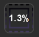

# Getting Started

!!! info "Did you turn it on?"

    **Note:** OBS must be open for most of these features to work!

## Installation
Install the BarRaider OBS plugin from the Elgato store or from our [Discord](http://discord.barraider.com)

1. After installing, enable from inside OBS: `Tools -> obs-websocket Setting`
    <figure markdown>
    
    <figcaption>Check that your settings match the settings in this image.  <strong>Set your own password.</strong></figcaption>
    </figure>

2. After following the steps above, drag one of the OBS Tools actions on to your Stream Deck and follow the setup wizard’s instructions. (You’ll need the port and password set in the previous step)

## Testing It Out
There are a ton of [Available Actions](./actions.md) in this plugin, but just to make sure everthing is working, let's add the `CPU Usage` action as a test. This action is pretty simple, __If OBS is on and everything is connected, it will display the CPU usage of OBS like this
    <figure markdown>
        
        <figcaption>A number showing how much CPU OBS is using should display on the key if it is working.</figcaption>
    </figure>

## It looks different
We use a few specific images to show when the plugin is having trouble communicating with OBS.  Visit [Troubleshooting]('troubleshooting.md') to learn what these images mean and how to deal with them.