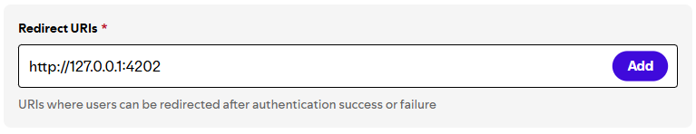

# Spotify - Getting Started

## Installation
Please follow the step-by-step instructions below to create your own Spotify Developer Application. (Client ID & Client Secret)

!!! warning

    An active Spotify Premium subscription is required to use the plugin. You can subscribe to Spotify Premium [here](https://www.spotify.com/uk/account/overview).

1. Open [Spotify Developer Dashboard](https://developer.spotify.com/dashboard/) and Login with your Spotify account.
2. Click the **Create app** button on the landing page.

    

3. Set the **App name** to anything of your choice.

    

    a. Set the **App description** to anything of your choice.

    

    b. Skip the **Website** field, this isn't required for the Stream Deck plugin to function.

    c. Set the **Redirect URI** to `http://localhost:4202`. You can copy the **Redirect URI** below:

    ```
    http://localhost:4202
    ```

    

    !!! warning

        Triple check the **Redirect URI** is correct, *before* proceeding. The plugin will fail to validate if it's any different.

    d.  Click the checkbox for **Web API**

    
    

4. Click the checkbox to agree to Spotify's Developer Terms of Service and Design Guidelines.

    

5. Compare your app settings with ours below, **before** you click **Save** in a hurry, just to be sure the settings are correct.

    

    !!! success

        Yay, you've created an app! 👏 We now need to fetch the **Client ID** and **Client secret** the plugin is requesting.

6. Click the **Settings** button on the home/dashboard page.

    

7. Click the **View client secret** hyperlink on the settings page.

    

8. Copy the **Client ID** and **Client secret** and paste them inside of the Spotify Integration setup.

    

    !!! warning

        Do not share your **Client secret**. If you accidentally leak it, click **Rotate client secret** to generate a new one.

9. Drag n' drop the **Play/Pause** action from the sidebar under the **Spotify [BarRaider]** category:

    

10. Click **Play** in Spotify on your device, and **whilst its playing** click the **Reload devices** button.

11. Lastly, click the dropdown menu above **Reload devices**, select your device... and enjoy!

    !!! note

        If you don't see your device listed, please refer to the **Device / playlist** section on the [troubleshooting](https://docs.barraider.com/faqs/spotify/troubleshooting/#the-device-dropdown-is-empty) page.
