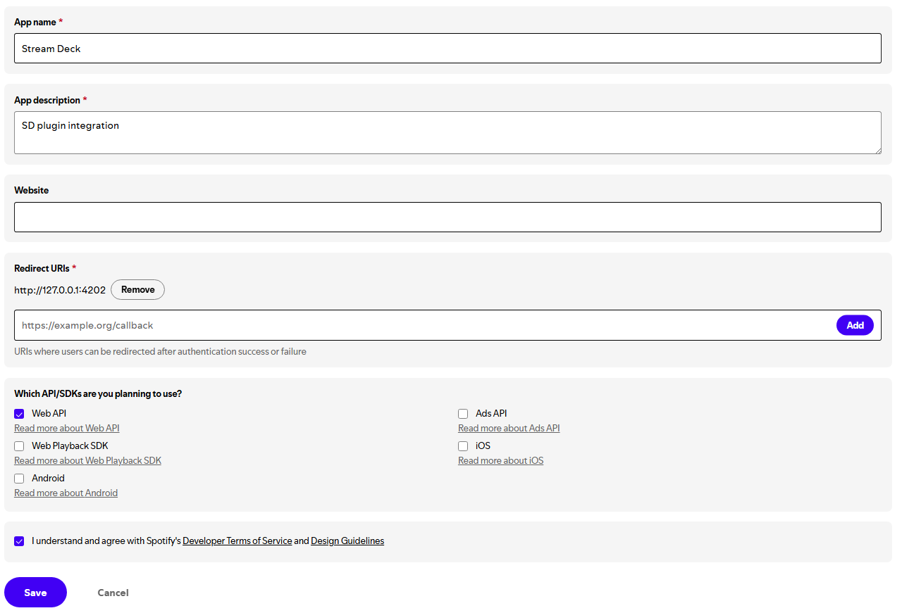

# Spotify - Getting Started

## Installation
Please follow the step-by-step instructions below to create your own Spotify Developer Application. (Client ID & Client Secret)

!!! warning "Spotify Premium required"

    An active Spotify Premium subscription is required to use the plugin.

### Create Spotify Developer App
1. Go to the [Spotify Developer Dashboard](https://developer.spotify.com/dashboard/ "Spotify developer dasboard").
2. Login using your Spotify account.
3. Click the **Create app** button.

    

4. Fill out the form with the following information.

    1. **App Name**: `Stream Deck`
        

    2. **App description**: `Stream Deck plugin integration`

    3. **Website**: Leave empty.

    4. **Redirect URI**: Copy text below then click **Add**.

        If you see **Auth v2** (1) in top left corner of Spotify Integration setup window:
        { .annotate } 

        1. 

        ```
        http://127.0.0.1:4202
        ```

        !!! warning annotate "Plugin version 3.1 or below"

            If you are using Spotfiy plugin version 3.1 or below, copy the **Redirect URI** below:
            ```
            http://localhost:4202
            ```

        
            
    5. Check the checkbox for **Web API**.

        

5. Accept Spotify's **Terms and Conditions**.

    

6. Compare your app settings with ours below, then click **Save**.

    

    ### Getting Spotify API Credentials

7. Click the **Settings** button in the application dasboard.

    

8. Click **View client secret**.

    

9. Copy the **Client ID** and **Client secret** and paste them inside of the Spotify Integration setup.

    

    !!! danger "Do not share your Client Secret!"

        Do not share your **Client secret**. If you accidentally share it, click **Rotate client secret** to generate a new one.

    ### Setting up play action button

10. Drag and drop the **Play/Pause** action from the sidebar under the **Spotify [BarRaider]** category.

    

11. To populate the device list:
    1. Start playing a song in the Spotify Application
    2. Whilst a song is playing, click the **Reload devices** button.
    3. Click the drowndown menu and select your device.
    
    !!! warning "Play music in your Spotify App"

        Make sure you are playing music in your Spotify Application before hitting reload devices.

    !!! question "My device list is still emtpy"

        If you don't see your device listed, please refer to the **Device / playlist** section on the [troubleshooting](../troubleshooting/#the-device-dropdown-is-empty "Troubleshooting emtpy device dropdown list") page.
