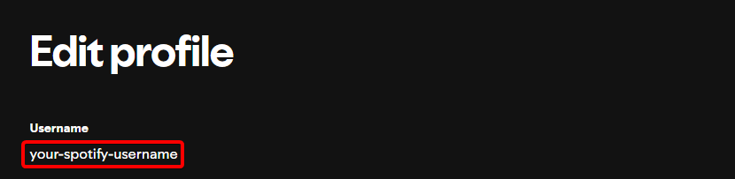

# Steps to get a Spotify Play URI
A  Spotify URI (Uniform Resource Identifier) is a unique identifier for Spotify content like playlists, songs, or albums.
It looks something like this: `spotify:track:6rqhFgbbKwnb9MLmUQDhG6`

1. Launch the **Spotify desktop** app.
2. Navigate to the playlist/song you want to get the URI for.
3. Open the Context Menu:
    1. Right-click the playlist name.
    2. Hover mouse over **Share**.
    2. Press and hold ++ctrl++ then click **Copy Spotify URI**.
5. Paste the link into the Play URI Action.

# Playing Liked Songs playlist from Stream Deck
Spotify does not allow for playing Liked Songs from the API, but there is a workaround using the Play URI action. Follow the steps below to get started!

1. Drag the **Play URI** button to your Stream Deck.
2. Select your **Device**.
3. Copy `spotify:user:<your-spotify-username>:collection` and paste it into the Play URI action.
4. Replace `<your-spotify-username>` with your Spotify username.

## Getting your Spotify username

1. Go to [Spotify Edit profile](https://www.spotify.com/account/profile/) page in your Browser.
2. Your username can then be found under **Username** (1)

1. 
