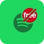
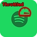
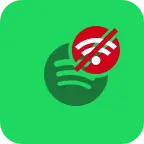
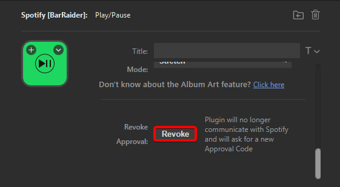
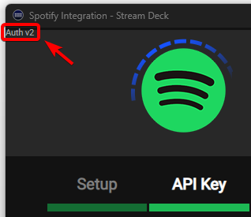

# Spotify - Troubleshooting

## General Issues

### Button error icons explained

| Icon | Explanation |
| --- | --- |
|  | Spotify Premium is required to use the Spotify plugin, this is a requirement set by Spotify. |
|  | The key is not configured, you need to **Revoke Approval** from the bottom of the **Play button** settings, then go trough wizard again because your tokens are invalid. |
|  | You are being throttled by Spotify, go to the [throttling section](./#throttling) to find out more. |
|  | The plugin lost connection to Spotify's servers. You can press the key to try and resume manually. |


### Button does not work or displays ⚠️
1. Make sure you set the Device setting to the device you want to play on.
2. Make sure the Private Session feature is not enabled. You may need to restart your PC after disabling it.

### I have a premium subscription but my button says "Free"
<div class="annotate" markdown>
   1. Log out from your Spotify desktop app.
   2. Go to [spotify.com](https://spotify.com/ "Spotify Website") and sign out.
   3. Press the **Revoke** button (1) in the Spotify plugin settings (at the very bottom).
   4. Restart your computer, sign in and try again.
</div>

1. 

### Wrong song/URI being added to playlist/written to file
Make sure you have a play/pause button active on that profile/page

## Throttling
### I'm seeing a throttled icon
If the button is telling that you are being throttled, Spotify has throttled your connection and there is nothing we can do. Please wait the time displayed on the button, and you should be un-throttled automatically.

### I'm getting a "Throttled" image on my keys for a few seconds and it then disappears
You are sending too many requests to Spotify. The following actions are API-intensive, consider removing them and see if it improves, or place the actions inside of a folder/ secondary profile.

- Play/Pause action.
- Repeat Mode action.
- Shuffle Mode action.
- Volume actions (if Display volume on key is enabled).

### I keep having to authenticate my account
This is a known issue if you are running Stream Deck as administrator. Doing this is strongly discouraged. It's firstly a security risk as it allows 3rd party plugins to run as administrator. Secondly, it is known to cause various issues in saving plugin settings as well as losing authentication tokens.

## Device / playlist
### The device dropdown is empty
**Note:** Not ALL devices will be recognized, simply because Spotify’s API doesn’t support them. SONOS is one example of devices not supported.

Start by playing a song in your player (the one you want to control). Then go out of the profile that has the Spotify action on and it, and then back in. Combo should populate. <br>
**If after the above it's not populating:**
Chances are you authorized on a different Spotify account than the one you're now playing the song in.

**Try the following:**
<div class="annotate" markdown>
1. Log out of your Spotify account in both your browser and Spotify app.
2. Press the **Revoke button** (1) on the Spotify plugin (at the very bottom of the settings).
3. Press the "Click here" message in the setup wizard.
4. Verify that it asks you to log in then log in again with the same username to both the player and the browser.
5. Leave the Stream Deck profile that has your Spotify plugin to another on, then go back.
</div>

1. 

### The playlist dropdown is empty
Start by playing a song in your player (the one you want to control). Then go out of the profile that has the Spotify action on and it, and then back in. Combo should populate.

### I don't see a certain playlist in the plugin
Spotify limits to the first 50 playlists. You can move a playlist up in the order from the Spotify App. Afterwards, try moving out of the Stream Deck profile and back in for it to refresh.

## Installation issues
### "INVALID_CLIENT: Invalid redirect URI" Error
The URL in step 4c in [getting started](../getting-started/) is incorrect.

1. Go to your [Spotify Developer Dashboard](https://developer.spotify.com/dashboard/login "Spotify Developer Dashboard") and click on your application.
2. Go to **Edit settings** in the top right corner.
3. Make sure **Redirect URIs** has:

      **Spotify plugin version 3.1.1 and later:**<br>
      If you have a **Auth v2** (1) in top left corner of Spotify Integration setup window:
      { .annotate } 

      1. 

      ```
      http://127.0.0.1:4202
      ```

      If you **DO NOT** see **Auth v2** in the top left corner use:

      ```
      http://localhost:4202
      ```

### "VALIDATION FAILED" Error
Spotify tries to connect, browser says it succeeded but plugin shows a VALIDATION FAILED error after ~60 seconds. 
Solution depends on what you see in your browser:

#### Browser shows an Error

1. Try restarting the Stream Deck and try again.
2. Change your default browser to Edge and try again.
3. In Edge browser follow [this guide](https://www.whatismybrowser.com/guides/how-to-enable-javascript/edge "How to enable JavaScript") and when you come across the allow/block list, add `127.0.0.1:4202` to the allow list.

#### Browser shows Success but plugin still won't connect
This is related to the plugin not being able to connect to Spotify's servers. There are a mix of reasons why this may happen. The most common are a Firewall, AntiVirus or VPN blocking connection. Locate which one of them on your PC is causing the issue and fix accordingly. 

#### Less common but also possible culprits

- Windows not being updated (make sure you have the latest Windows Update), 
- Spotify is infamous to having issues with IPv6. Follow [this guide](https://buz.bz/ipv6 "How to disable IPv6 on Windows 10 and 11") on disabling it to see if it helps.