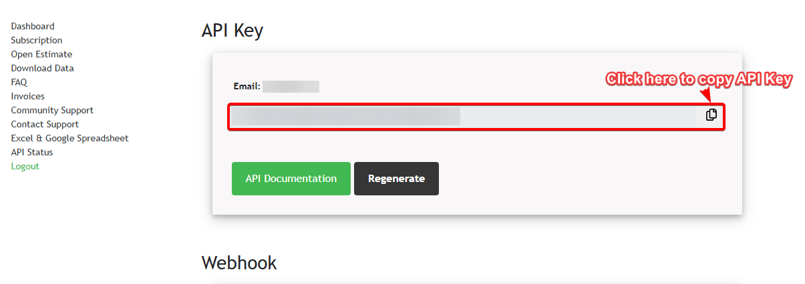
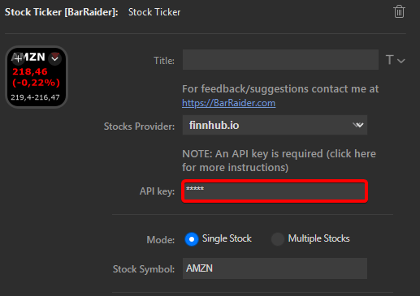

# Stock Ticker - Setting up finnhub.io API Key

1. Register a free account at [finnhub.io](https://finnhub.io/dashboard).

    !!!warning Valid Email

        Make sure you are using a valid email address.

2. Verify the account by clicking on the email received.
3. Go to the [dashboard](https://finnhub.io/dashboard) and copy the API Key.

    

4. Paste the API key you got from finnhub.io into the API Key field in **Stock Ticker settings**.

    
